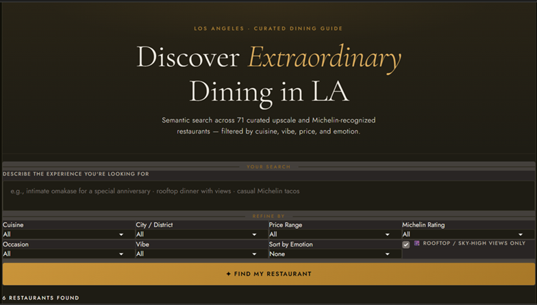
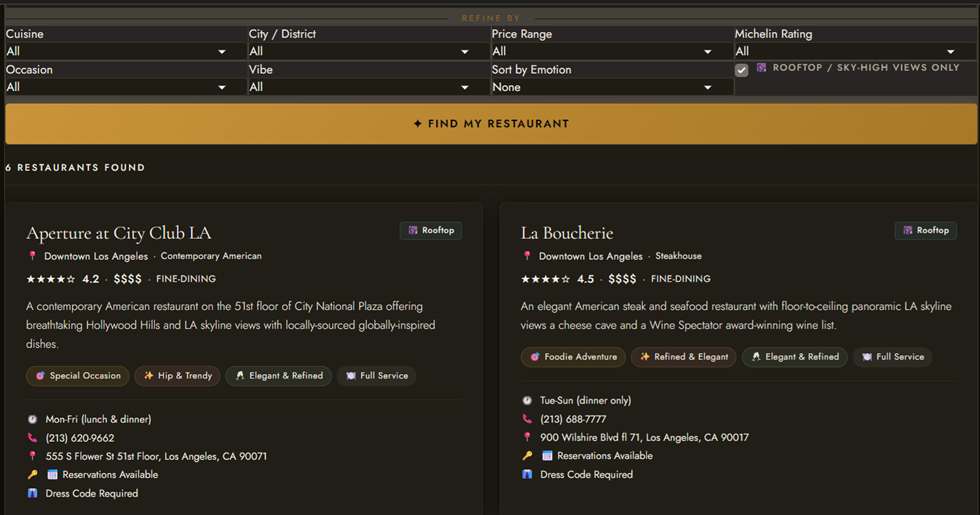

# 🍽️ LA Luxury Restaurant Recommendation System
### *An End-to-End NLP & Semantic Search Pipeline for Upscale Dining in Los Angeles*

[](https://www.python.org/)
[](https://huggingface.co/)
[](https://www.trychroma.com/)
[](https://www.gradio.app/)
[](https://www.anthropic.com/)
[](LICENSE)

---

## 📌 Project Overview

This project is a **production-style, multi-stage AI pipeline** that transforms a curated dataset of 71 upscale and Michelin-recognized Los Angeles restaurants into an intelligent, conversational recommendation engine. Users can query the system in plain English — *"romantic rooftop Italian restaurant in Beverly Hills"* — and receive semantically ranked, filter-refined recommendations powered by embeddings, zero-shot classification, emotion analysis, and a large language model.

Built as an adaptation of the [FreeCodeCamp Semantic Book Recommender tutorial](https://www.freecodecamp.org/news/build-a-semantic-book-recommender-using-an-llm-and-python/), this project translates that framework into the restaurant domain, extending it with multi-notebook architecture, metadata enrichment, multi-label NLP classification, and an interactive Gradio front end.

> **Scope:** Los Angeles County — including Downtown LA, Beverly Hills, West Hollywood, Santa Monica, Hollywood, Culver City, Malibu, and surrounding neighborhoods. Restaurants span Michelin 3-Star down to Michelin Selected and high-end non-Michelin establishments.

---

## 🎬 Project Demo

### VS Code Project Structure & Gradio Dashboard

| Project Structure & Dashboard Code |
|---|
|  |

| Gradio Dashboard UI |
|---|
|  |

---

## 🧠 What This Project Demonstrates

This is not a tutorial copy — it is a **domain-adapted, multi-notebook AI engineering project** that showcases:

| Skill Area | What Was Applied |
|---|---|
| **Data Engineering** | CSV ingestion, multi-column inspection, whitespace normalization, address correction, metadata column generation |
| **Semantic Search** | Sentence transformer embeddings + ChromaDB vector store with persisted storage |
| **NLP Classification** | Zero-shot classification via `facebook/bart-large-mnli` for cuisine, occasion, and vibe |
| **Emotion & Sentiment Analysis** | Multi-label emotion scoring via `distilbert-base-uncased-emotion` + dominant emotion extraction |
| **LLM Integration** | Claude Sonnet via Anthropic API for natural language recommendation synthesis |
| **Pipeline Architecture** | 4-notebook modular design with shared CSV artifacts between stages |
| **UI Development** | Gradio dashboard with real-time query, multi-filter support, and restaurant cards |
| **Software Engineering** | `.env` secret management, `.gitignore`, YAML-based version control & script validation |

---

## 🗂️ Project Structure

```
RestaurantRecommenderLLM/
│
├── data/
│   ├── cleaned_restaurant_List.csv              # Original cleaned dataset (71 restaurants)
│   ├── cleaned_restaurants_final.csv            # + restaurant_metadata column
│   ├── restaurants_with_classifications.csv     # + cuisine group, dining format, occasion, vibe
│   ├── restaurants_with_emotions.csv            # + 7 emotion scores, sentiment, dining mood
│   └── tagged_restaurant_descriptions.txt       # Formatted text for ChromaDB ingestion
│
├── jupyter_scripts/
│   ├── 1_Restaurant_Data_Cleanup.ipynb          # Stage 1: Data inspection & enrichment
│   ├── 2_Restaurant_Vector_Search.ipynb         # Stage 2: Embeddings & semantic retrieval
│   ├── 3_Restaurant_Text_Classification.ipynb   # Stage 3: Zero-shot NLP classification
│   └── 4_Restaurant_Sentiment_Analysis.ipynb    # Stage 4: Emotion & sentiment scoring
│
├── gradio_app/
│   └── GradioDashboard.py                       # Interactive web UI
│
├── chroma_restaurants/                          # Persisted ChromaDB vector store
│
├── photos/
│   ├── SamplePic1.png
│   └── SamplePic2.png
│
├── .env                                         # API keys (never committed)
├── .gitignore
└── README.md
```

---

## ⚙️ Multi-Notebook Pipeline Architecture

Each Jupyter notebook is a self-contained stage that reads from and writes to shared CSV artifacts. This modular design allows each component to be tested, updated, or swapped independently — a hallmark of production-grade ML pipelines.

```
Raw CSV
   │
   ▼
[Notebook 1] Data Cleanup & Metadata Generation
   → cleaned_restaurants_final.csv  (+restaurant_metadata)
   │
   ▼
[Notebook 2] Vector Embeddings & Semantic Search
   → chroma_restaurants/ (persisted ChromaDB)
   │
   ▼
[Notebook 3] Zero-Shot Text Classification
   → restaurants_with_classifications.csv  (+cuisine_group, dining_format, occasion, vibe)
   │
   ▼
[Notebook 4] Emotion & Sentiment Analysis
   → restaurants_with_emotions.csv  (+7 emotion scores, dominant_emotion, dining_mood)
   │
   ▼
[Gradio Dashboard] — Combines all stages for live querying
```

---

## 📓 Notebook Breakdown

### Notebook 1 — Data Cleanup & Metadata Enrichment
- Inspected all 14 columns across 71 restaurant records
- Resolved trailing whitespace in `Address` and `Description` columns
- Corrected a missing comma in Mastro's Ocean Club address
- Fixed an incorrect zip code for Morihiro (Echo Park location)
- Confirmed intentional multi-location entries for Pine & Crane and Badmaash
- Generated a `restaurant_metadata` column combining structured fields into enriched descriptive text for downstream NLP tasks

### Notebook 2 — Vector Search with ChromaDB
- Loaded `tagged_restaurant_descriptions.txt` into ChromaDB using `all-MiniLM-L6-v2` sentence embeddings (HuggingFace, local inference — no API cost)
- Implemented a **candidate pool strategy** to prevent filter depletion when combining semantic search with metadata filters
- Core retrieval function accepts 6 parameters: `query`, `top_k`, `michelin_filter`, `price_filter`, `atmosphere_filter`, `rooftop_only`
- Includes 10 diverse test queries and a scored similarity debugging cell
- ChromaDB store persisted to `./chroma_restaurants/` for reuse across sessions

### Notebook 3 — Zero-Shot Text Classification
- Used `facebook/bart-large-mnli` to classify each restaurant across three dimensions without any labeled training data:
  - **Cuisine Group** — e.g., Japanese, Italian, Seafood, Mexican
  - **Dining Format** — e.g., Tasting Menu / Omakase, Full Service, Counter Dining
  - **Best For (Occasion)** — e.g., Special Occasion, Date Night, Business Dinner
  - **Vibe** — e.g., Refined & Elegant, Hip & Trendy, Casual & Relaxed
- Confidence scores stored alongside each label for downstream filtering
- Output: `restaurants_with_classifications.csv` (21 columns)

### Notebook 4 — Emotion & Sentiment Analysis
- Applied `bhadresh-savani/distilbert-base-uncased-emotion` to `restaurant_metadata` field
- Extracted 7 per-restaurant emotion probability scores: `anger`, `disgust`, `fear`, `joy`, `neutral`, `sadness`, `surprise`
- Derived `dominant_emotion` and `dining_mood` labels from score distributions
- Added `overall_sentiment` (Positive / Neutral / Negative) using a secondary sentiment classifier
- Output: `restaurants_with_emotions.csv` (32 columns) — the final enriched dataset powering the Gradio dashboard

---

## 🤖 Models & Tools Used

### Embeddings
| Model | Purpose |
|---|---|
| `sentence-transformers/all-MiniLM-L6-v2` | Dense vector embeddings for semantic similarity search |

### Classification
| Model | Purpose |
|---|---|
| `facebook/bart-large-mnli` | Zero-shot multi-label classification (cuisine, format, occasion, vibe) |

### Sentiment & Emotion
| Model | Purpose |
|---|---|
| `bhadresh-savani/distilbert-base-uncased-emotion` | 7-class emotion scoring from text |
| Secondary sentiment classifier | Positive / Neutral / Negative overall sentiment |

### LLM
| Model | Purpose |
|---|---|
| Claude Sonnet (Anthropic API) | Natural language recommendation synthesis and query understanding |

### Infrastructure
| Tool | Role |
|---|---|
| **ChromaDB** | Local persisted vector store |
| **Gradio** | Web dashboard UI |
| **pandas** | Data manipulation across all pipeline stages |
| **python-dotenv** | Secure API key management via `.env` |
| **YAML** | Version control, script validation & pipeline verification |

---

## 🗄️ Dataset

- **71 curated restaurants** across Los Angeles County
- Covers Michelin 3-Star, 2-Star, 1-Star, Bib Gourmand, Michelin Selected, and high-end non-Michelin establishments
- Data sourced from: Michelin Guide, OpenTable, Time Out LA, restaurant websites
- Each restaurant record contains 14 base fields, enriched to **32 columns** by end of pipeline

**Sample enriched columns in final dataset:**

| Column | Description |
|---|---|
| `restaurant_metadata` | Enriched descriptive text for NLP tasks |
| `simple_cuisine_group` | Classified cuisine category |
| `dining_format` | Tasting Menu, Full Service, Counter, etc. |
| `predicted_occasion` | Best For — Special Occasion, Date Night, etc. |
| `predicted_vibe` | Refined & Elegant, Hip & Trendy, etc. |
| `emotion_joy` / `emotion_neutral` / ... | Per-restaurant emotion probability scores |
| `dominant_emotion` | Highest-scoring emotion label |
| `dining_mood` | Human-readable mood derived from emotion profile |
| `overall_sentiment` | Positive / Neutral / Negative |

---

## 🔄 Version Control & Validation

This project uses a **YAML configuration file** to manage script versions, track pipeline stage dependencies, and validate that each notebook's output schema matches expected column definitions before the next stage ingests it. This ensures pipeline integrity when notebooks are updated or re-run out of order — a critical safeguard in multi-stage ML workflows.

---

## 🚀 Getting Started

### Prerequisites
- Python 3.11+
- pip / virtualenv
- Anthropic API key

### Installation

```bash
git clone https://github.com/papasmurf79/RestaurantRecommenderLLM.git
cd RestaurantRecommenderLLM
python -m venv .venv
source .venv/bin/activate  # Windows: .venv\Scripts\activate
pip install -r requirements.txt
```

### Environment Setup

Create a `.env` file in the project root:

```
ANTHROPIC_API_KEY=your_anthropic_api_key_here
```

### Running the Pipeline

Run notebooks in order from the `jupyter_scripts/` directory:

```
1_Restaurant_Data_Cleanup.ipynb
2_Restaurant_Vector_Search.ipynb
3_Restaurant_Text_Classification.ipynb
4_Restaurant_Sentiment_Analysis.ipynb
```

### Launching the Dashboard

```bash
cd gradio_app
python GradioDashboard.py
```

---

## 🔮 Planned Enhancements

- [ ] Natural language filter parsing using Claude (e.g., "under $200 per person" → `price_filter`)
- [ ] Map integration for neighborhood-based browsing
- [ ] OpenTable / Tock reservation link embedding
- [ ] Voice AI agent to read back restaurant information 
- [ ] User preference memory across sessions
- [ ] Expansion to Orange County and San Diego restaurant datasets
- [ ] Streamlit or React frontend migration
- [ ] CI/CD pipeline for automated data refresh

---

## 📚 References & Inspiration

- [FreeCodeCamp — Build a Semantic Book Recommender Using an LLM and Python](https://www.freecodecamp.org/news/build-a-semantic-book-recommender-using-an-llm-and-python/)
- [Supercharge Restaurant Recommendations with LLM and Qdrant — Medium](https://medium.com/@parikshitsaikia1619/supercharge-restaurant-recommendations-with-llm-and-qdrant-911fc57505ed)
- [Restaurant Recommender LLM — DoraHacks](https://dorahacks.io/buidl/25758)
- [Anthropic Claude API Documentation](https://docs.anthropic.com/)
- [ChromaDB Documentation](https://docs.trychroma.com/)
- [HuggingFace Transformers](https://huggingface.co/docs/transformers/)
- [Michelin Guide — Los Angeles](https://guide.michelin.com/us/en/california/us-los-angeles/restaurants)

---

## 👤 Author

**Papasmurf**
AI Engineer | NLP & Semantic Search | Los Angeles, CA

---

*Built with curiosity, sashimi, and a deep respect for the Michelin Guide.*
